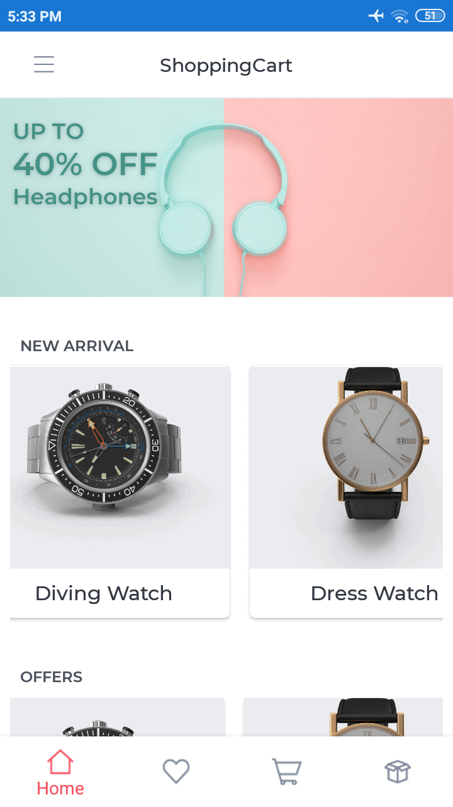
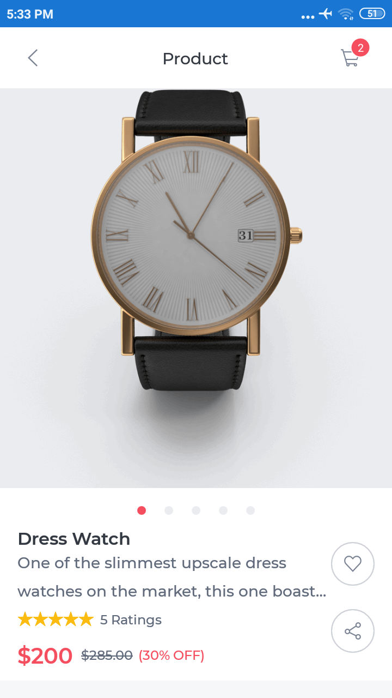
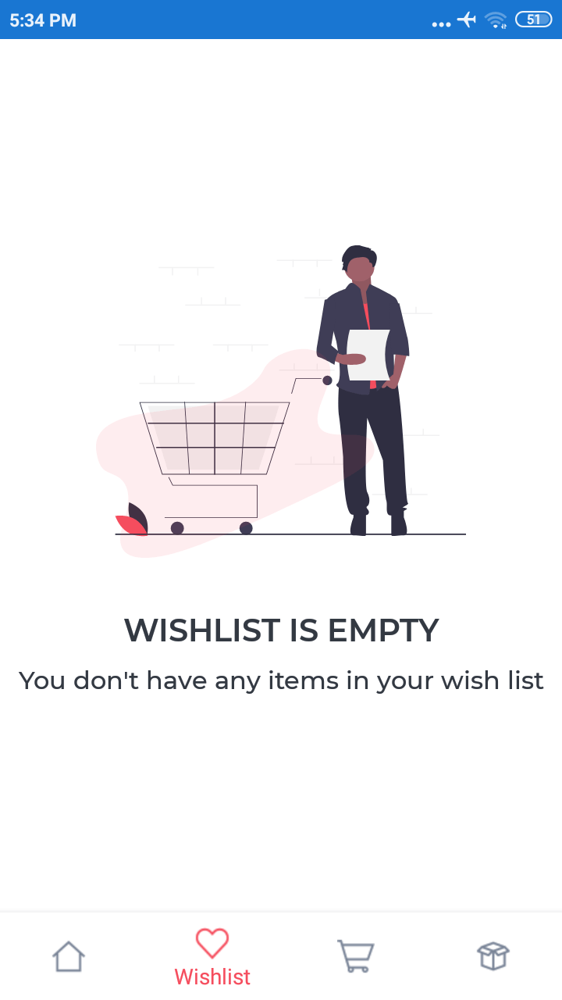

# ShoppingCart
 
The Shopping Cart is an online shopping application developed using Syncfusion’s Xamarin UI controls and  Essential UI Kit on the Xamarin.Forms platform. It’s been integrated with mock data to test the application without any database or cloud configurations.

## Features integrated

* Display product in categories
* Product details
* Wishlist
* Cart
* Checkout
* Order History
* Contact Us page
* About Us page

This project uses the following patterns and features:

* XAML UI
* Converters
* Custom controls
* Data binding
* Behaviors
* MVVM
* Styles
 
## Syncfusion controls

This project uses the following Syncfusion controls:

* Button
* Cards
* Expander
* Badge View
* Busy Indicator
* ComboBox
* ListView
* Maps
* Rating
* Rotator 

## Screens

**Android**

   

**iOS**

   

## Third-party NuGet packages
 
This application uses the following third-party assemblies:

* Xamarin.Essentials
* AutoFac
* AutoMapper
* SkiaSharp.Extended
* SkiaSharp.Svg
* SkiaSharp.Views.Forms
* sqlite-net-pcl

## Requirements to run the sample

* Visual Studio 2017
* Xamarin add-ons for Visual Studio (available via the Visual Studio installer)

## How to run the sample

1. Clone the sample and open it in Visual Studio.
2. Register your license key in App.cs as shown below.

        public App()
        {
            //Register Syncfusion license
            Syncfusion.Licensing.SyncfusionLicenseProvider.RegisterLicense("YOUR LICENSE KEY");

            InitializeComponent();

            MainPage = new MasterDetail();
        } 

Please refer to this [link](https://help.syncfusion.com/common/essential-studio/licensing/license-key#xamarinforms) for more information about Syncfusion licenses.

3. Set any one of the platform-specific projects (iOS, Android) as a startup project.
4. Clean and build the application.
5. Run the application.
 
## Disclaimer
 
Syncfusion has no liability for any damage or consequence that may arise by the use or viewing of the examples. The examples are for demonstrative purposes and if you choose to use or access the examples you agree to not hold Syncfusion liable, in any form, for any damage that is related to use, accessing or otherwise viewing the examples. By accessing, viewing, or otherwise seeing the examples you acknowledge and agree Syncfusion’s examples will not allow you to seek injunctive relief in any form for any claim related to the sample. If you do not agree to this, do not view, access, utilize or otherwise do anything with Syncfusion’s examples.
